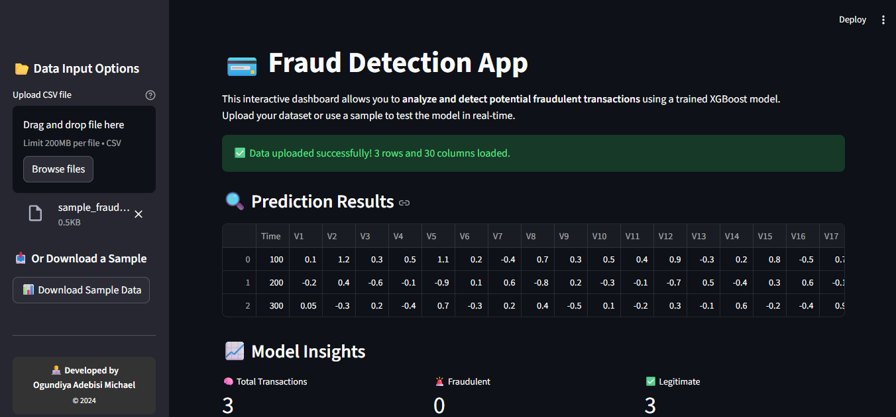

# 💳 Credit Card Fraud Detection Dashboard

This project is a **Machine Learning-powered Fraud Detection Dashboard** built with **Streamlit** and **XGBoost**.  
It allows users to upload transaction data (CSV format) and detect **potential fraudulent transactions** in real-time.
The model is trained on the popular **credit card fraud dataset** and can predict anomalies using advanced gradient boosting algorithms.

An interactive **Streamlit web application** for detecting fraudulent credit card transactions in real-time using a trained **XGBoost model**.Includes sample data download, and visual insights.

---
## 📊 Dataset
Due to GitHub file size limits, the dataset is not included.  
Download the original [Credit Card Fraud Detection Dataset](https://www.kaggle.com/mlg-ulb/creditcardfraud) from Kaggle 

## 🖥️ Dashboard Preview

Here’s what the Fraud Detection Dashboard looks like:

## 🚀 Features

- 🧠 Machine Learning model (XGBoost) trained on real-world credit card data  
- 🧾 Upload CSV transaction data directly on the dashboard  
- ⚡ Real-time fraud detection using trained **XGBoost** model  
- 📊 Interactive and clean UI built with **Streamlit**  
- 📈 Preview of uploaded dataset and prediction results  
- 👤 Custom footer with author information   
  

## 🛠️ Installation & Setup Instructions

### 1️⃣ Clone the repository

### 2️⃣ Create a virtual environment

### 3️⃣ Install dependencies

### 4️⃣ streamlit run fraud_dashboard.py

## 🧩 Model Information

The trained XGBoost model (fraud_xgb_model.json) achieves:

| Metric    | Score  |
| --------- | ------ |
| Accuracy  | 99.96% |
| AUC       | 0.999  |
| Precision | 0.998  |
| Recall    | 0.997  |

💡 Future Improvements

Add model retraining functionality

Integrate live transaction APIs

🧑‍💻 Author

Ogundiya Adebisi Michael

© 2024 | Data Analyst 

📧 Michaelopiii@gmail.com 

🌐 https://linkedin.com/in/ogundiyaa)

